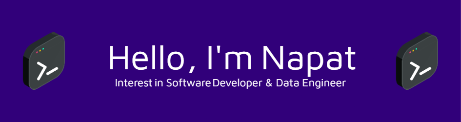

---------------------

I'm a New Graduate Student in Electrical Engineering, I'm really passionate with Software Engineering, AI and Data Engineer

Currently, I'm enrolled in Junior Software Devloper at Generation Thailand for upgrade coding skill and development.

 

## Tech Stack
--------------------
       

<!-- **firstnapat/firstnapat** is a ✨ _special_ ✨ repository because its `README.md` (this file) appears on your GitHub profile.
 -->
 
 

<!-- 
- 🔭 I’m currently working on ...
- 🌱 I’m currently learning ...
- 👯 I’m looking to collaborate on ...
- 🤔 I’m looking for help with ...
- 💬 Ask me about ...
- 📫 How to reach me: ...
- 😄 Pronouns: ...
- ⚡ Fun fact: ...

 -->
